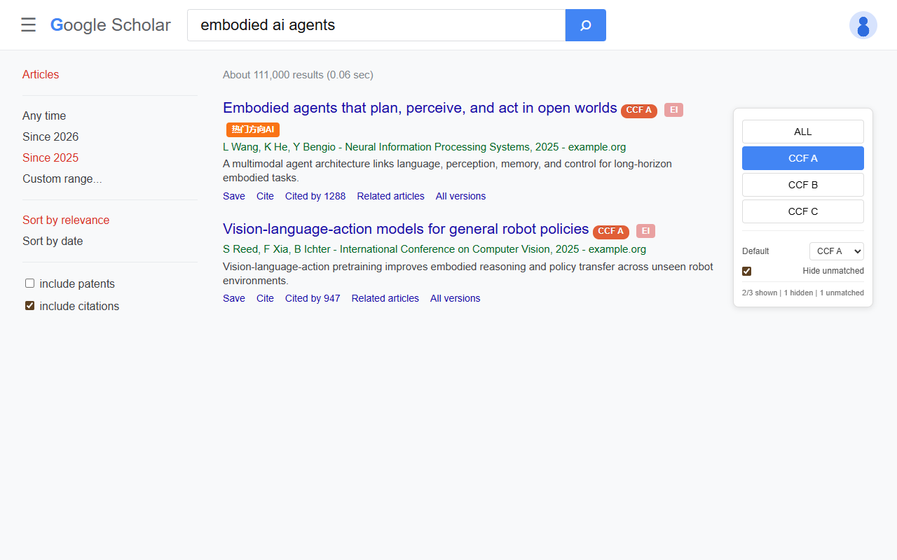
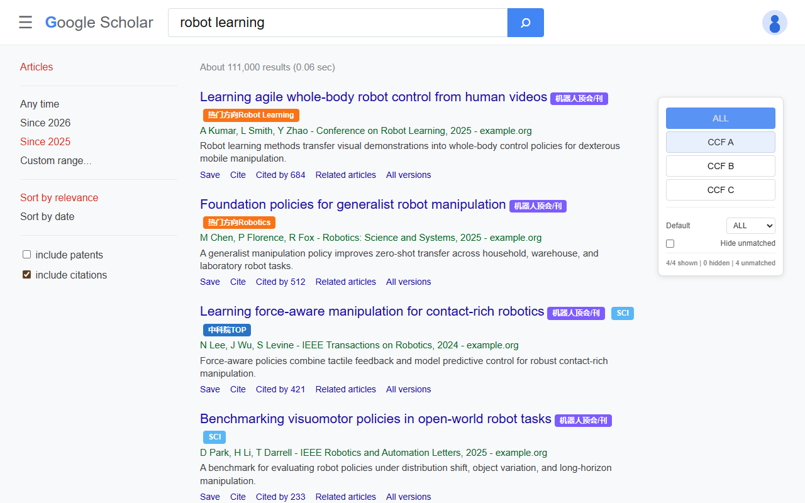
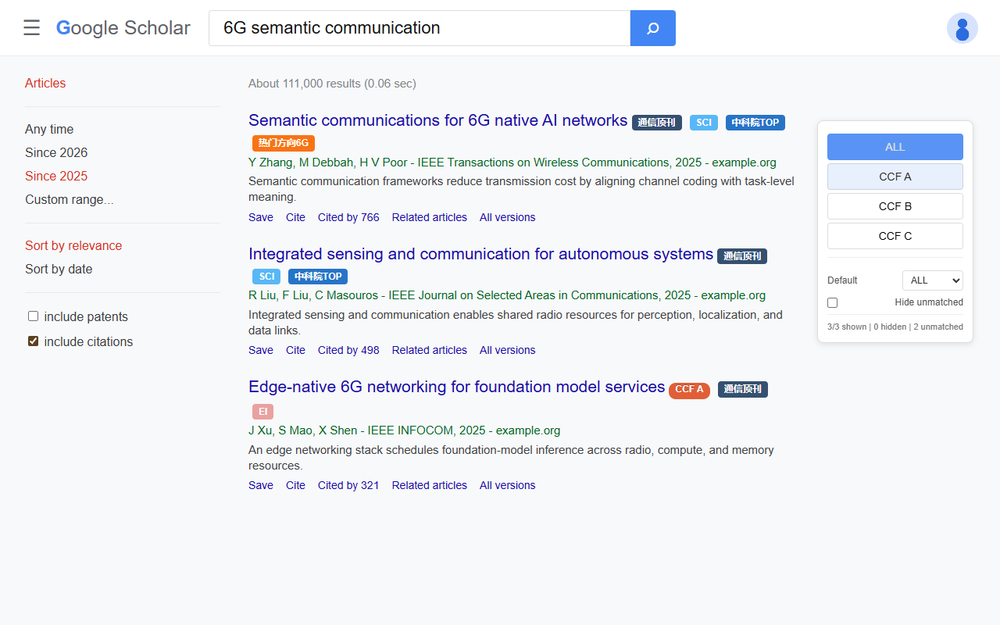
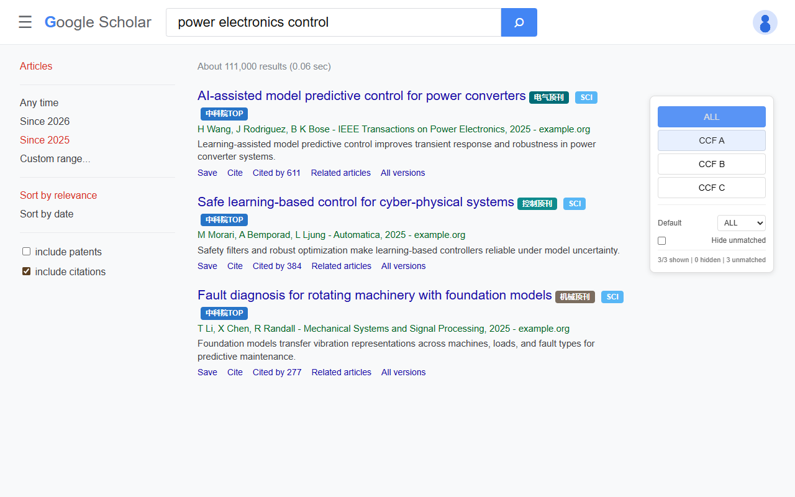

<h1 align="center">
  
  OnlyCCFA
</h1>

<p align="center">
  <a href="https://github.com/zay002/OnlyCCFA">
    
  </a>
  <a href="https://chromewebstore.google.com/detail/onlyccfa/cgbjdimlhdcjinagiacapnkmhpjkeabh">
    
  </a>
</p>

OnlyCCFA is an independent Chrome extension based on [CCFrank](https://github.com/WenyanLiu/CCFrank4dblp). It keeps the original CCF rank labels, and makes Google Scholar search stricter: by default, Google Scholar search results only show papers recognized as CCF A.

OnlyCCFA 是基于 [CCFrank](https://github.com/WenyanLiu/CCFrank4dblp) 的独立 Chrome 扩展。它保留原有 CCF 等级标签能力，并进一步强化 Google 学术搜索体验：默认只显示识别为 CCF-A 的论文结果。

## Features

- Shows CCF recommended ranks for papers on Google Scholar, dblp, Connected Papers, Semantic Scholar and Web of Science.
- Adds an open multi-source rank badge framework for SCI, CAS partition, SCI TOP, EI, PKU Core, CSCD, CSSCI, school-specific lists and domain-prestige venues in robotics, control, electrical engineering, communications and mechanical engineering.
- Filters Google Scholar search results to CCF-A papers by default.
- Keeps an on-page rank switcher so you can change between `ALL`, `CCF A`, `CCF B` and `CCF C`.
- Lets you save the default Google Scholar filter and choose whether unmatched results should stay visible.
- Shows how many results are visible, hidden and unmatched after filtering.
- Adds local Google Scholar venue matching before falling back to DBLP lookup, improving matches for venues such as NeurIPS, CVPR, SIGMOD, AAAI and ICLR.

## Screenshots

OnlyCCFA screenshots are organized around research workflows, not button states. The examples below use current high-interest directions such as embodied AI, robot learning, 6G communication and AI-assisted engineering control.

| Embodied AI: CCF-A first                                                                                | Robot learning: prestige beyond CCF                                                                           |
| ------------------------------------------------------------------------------------------------------- | ------------------------------------------------------------------------------------------------------------- |
|  |  |

| 6G communication: open source-rank badges                                                                | Engineering control: EE, control and mechanical venues                                                                 |
| -------------------------------------------------------------------------------------------------------- | ---------------------------------------------------------------------------------------------------------------------- |
|  |  |

## Install

Install OnlyCCFA from the Chrome Web Store:

[OnlyCCFA - Chrome Web Store](https://chromewebstore.google.com/detail/onlyccfa/cgbjdimlhdcjinagiacapnkmhpjkeabh)

You can also load OnlyCCFA from source as an unpacked Chrome extension for development.

1. Open `chrome://extensions`.
2. Enable `Developer mode`.
3. Click `Load unpacked`.
4. Select this repository directory.
5. Open Google Scholar and search as usual.

When testing local changes, click the extension card's reload button in `chrome://extensions` before refreshing Google Scholar.

## Development

Run the local test suite:

```bash
npm test
```

The tests cover:

- Google Scholar default CCF-A filtering behavior.
- Saved filter preferences and unmatched-result handling.
- Filter result statistics.
- Google Scholar venue extraction.
- Local venue-to-CCF matching for common CCF-A venues.
- Open multi-source rank matching for common journals, conferences and Chinese core journals.

## Data Sources

OnlyCCFA uses a transparent data-source structure in `data/openRankSources.js`.

The built-in list is an open seed dataset for common venues, Chinese core journals and high-reputation domain venues such as CoRL, RSS, ICRA, IROS, TRO, IJRR, RA-L, Automatica, IEEE TAC, IEEE TPEL, IEEE TWC and IEEE JSAC.

It is designed to be expanded from official public lists or clearly licensed open datasets. OnlyCCFA does not copy EasyScholar's packaged data.

## Release

Prepare a release package:

```bash
npm run package
```

This creates:

- `dist/OnlyCCFA-<version>.zip`

## Credits

OnlyCCFA is currently maintained by [Zhaoyang Li](https://github.com/zay002).

This project is based on CCFrank / CCFrank4dblp. Many thanks to Wenyan Liu and all previous CCFrank contributors for the original extension, CCF data work, platform support, bug fixes and maintenance. Their work made OnlyCCFA possible.

Original project: [WenyanLiu/CCFrank4dblp](https://github.com/WenyanLiu/CCFrank4dblp)

## Contributors

<table>
  <tbody>
    <tr>
      <td align="center" valign="top" width="14.28%">
        <a href="https://github.com/zay002">
          
          <br />
          <sub><b>Zhaoyang Li</b></sub>
        </a>
        <br />
        Code, documentation, tests, maintenance
      </td>
    </tr>
  </tbody>
</table>

## License

OnlyCCFA is released under the MIT License.

Original CCFrank copyright notices are retained. OnlyCCFA modifications are copyright 2026 Zhaoyang Li.
