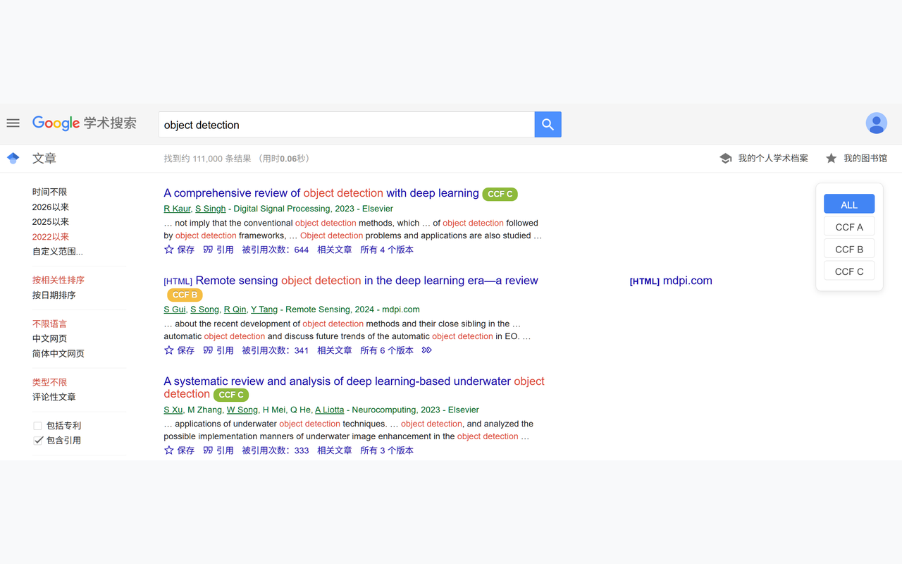
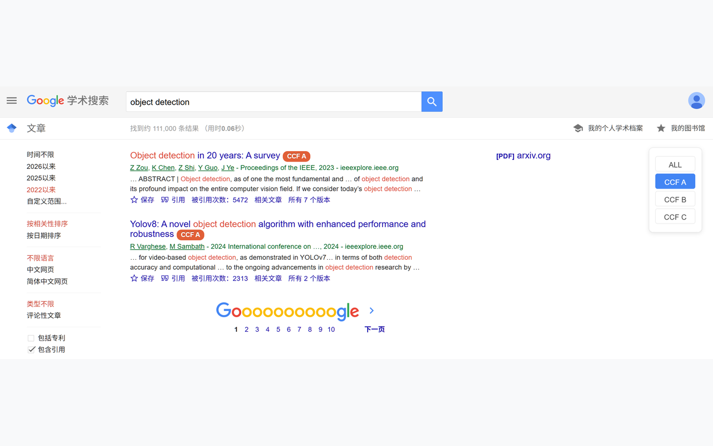
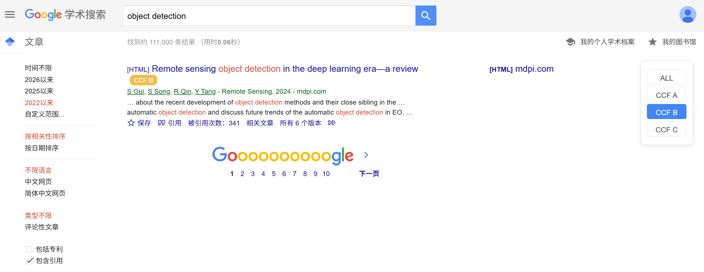
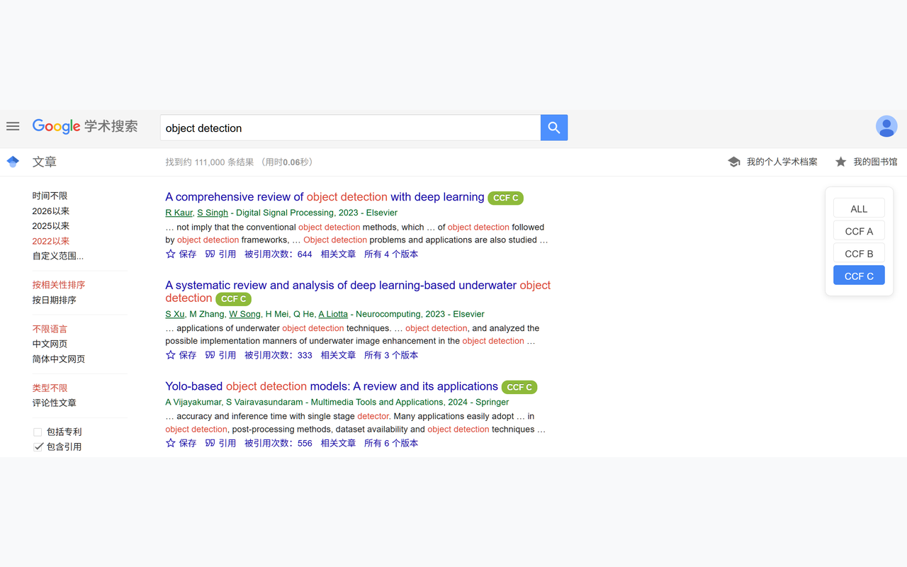

<h1 align="center">
  
  OnlyCCFA
</h1>

<p align="center">
  <a href="https://github.com/zay002/OnlyCCFA">
    
  </a>
</p>

OnlyCCFA is an independent Chrome extension based on [CCFrank](https://github.com/WenyanLiu/CCFrank4dblp). It keeps the original CCF rank labels, and makes Google Scholar search stricter: by default, Google Scholar search results only show papers recognized as CCF A.

OnlyCCFA 是基于 [CCFrank](https://github.com/WenyanLiu/CCFrank4dblp) 的独立 Chrome 扩展。它保留原有 CCF 等级标签能力，并进一步强化 Google 学术搜索体验：默认只显示识别为 CCF-A 的论文结果。

## Features

- Shows CCF recommended ranks for papers on Google Scholar, dblp, Connected Papers, Semantic Scholar and Web of Science.
- Filters Google Scholar search results to CCF-A papers by default.
- Keeps an on-page rank switcher so you can change between `ALL`, `CCF A`, `CCF B` and `CCF C`.
- Adds local Google Scholar venue matching before falling back to DBLP lookup, improving matches for venues such as NeurIPS, CVPR, SIGMOD, AAAI and ICLR.

## Screenshots

| ALL                                                                                     | CCF A                                                                                           |
| --------------------------------------------------------------------------------------- | ----------------------------------------------------------------------------------------------- |
|  |  |

| CCF B                                                                                           | CCF C                                                                                           |
| ----------------------------------------------------------------------------------------------- | ----------------------------------------------------------------------------------------------- |
|  |  |

## Install

OnlyCCFA is intended to be loaded from source as an unpacked Chrome extension.

1. Open `chrome://extensions`.
2. Enable `Developer mode`.
3. Click `Load unpacked`.
4. Select this repository directory.
5. Open Google Scholar and search as usual.

When testing local changes, click the extension card's reload button in `chrome://extensions` before refreshing Google Scholar.

## Development

Run the local test suite:

```bash
npm test
```

The tests cover:

- Google Scholar default CCF-A filtering behavior.
- Google Scholar venue extraction.
- Local venue-to-CCF matching for common CCF-A venues.

## Credits

OnlyCCFA is currently maintained by [Zhaoyang Li](https://github.com/zay002).

This project is based on CCFrank / CCFrank4dblp. Many thanks to Wenyan Liu and all previous CCFrank contributors for the original extension, CCF data work, platform support, bug fixes and maintenance. Their work made OnlyCCFA possible.

Original project: [WenyanLiu/CCFrank4dblp](https://github.com/WenyanLiu/CCFrank4dblp)

## Contributors

<table>
  <tbody>
    <tr>
      <td align="center" valign="top" width="14.28%">
        <a href="https://github.com/zay002">
          
          <br />
          <sub><b>Zhaoyang Li</b></sub>
        </a>
        <br />
        Code, documentation, tests, maintenance
      </td>
    </tr>
  </tbody>
</table>

## License

OnlyCCFA is released under the MIT License.

Original CCFrank copyright notices are retained. OnlyCCFA modifications are copyright 2026 Zhaoyang Li.
