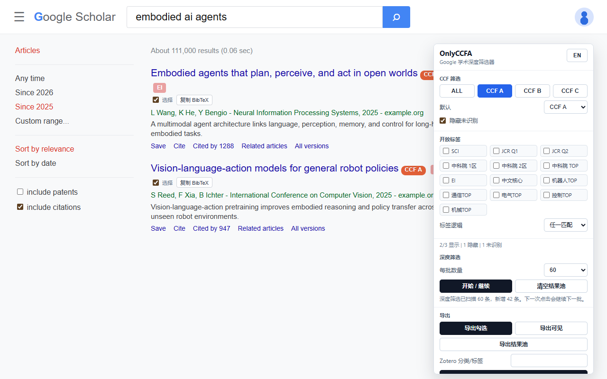
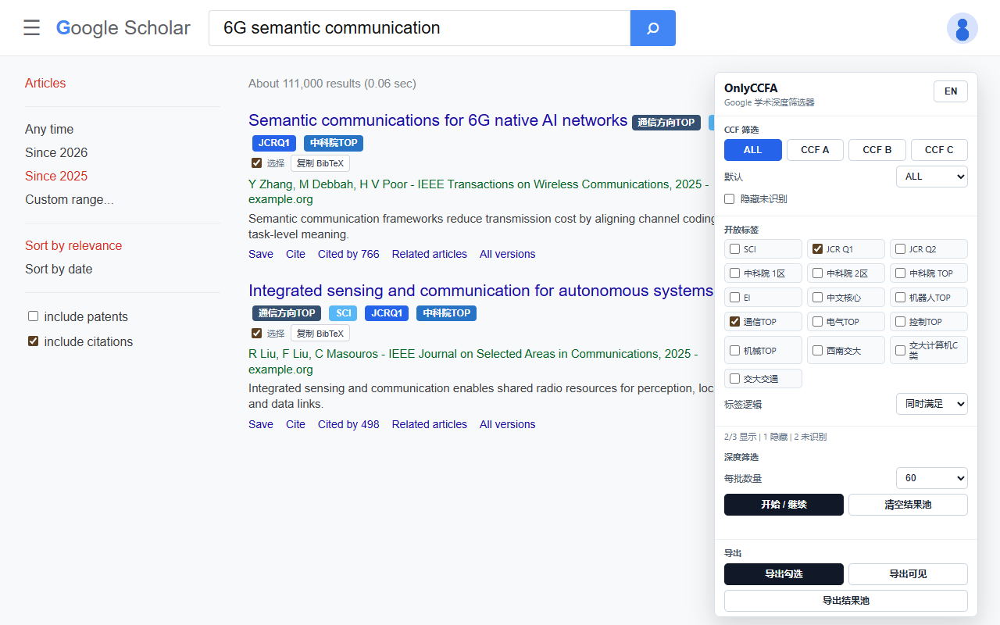
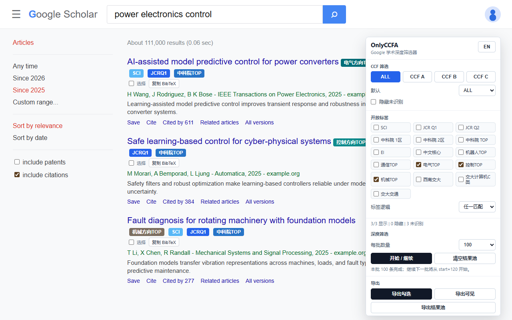

<h1 align="center">
  
  OnlyCCFA
</h1>

<p align="center">
  <a href="https://github.com/zay002/OnlyCCFA">
    
  </a>
  <a href="https://chromewebstore.google.com/detail/onlyccfa/cgbjdimlhdcjinagiacapnkmhpjkeabh">
    
  </a>
</p>

<p align="center">
  <a href="./README.md">中文</a> | English
</p>

OnlyCCFA is an independent Chrome extension based on [CCFrank](https://github.com/WenyanLiu/CCFrank4dblp). It keeps the original CCF rank labels and turns Google Scholar into a stricter paper-search workflow: load multiple Google Scholar pages, filter the local result pool by CCF, SCI/JCR, CAS partition, EI, Chinese core journal and field TOP venue badges, then export clean candidates to BibTeX or Zotero.

The goal is simple: help students and researchers in computer science, robotics, mechanical engineering, electrical engineering and communications see venue-quality signals directly in their daily paper search results, with data that is transparent, extensible and free.

## Features

- Shows CCF recommended ranks for papers on Google Scholar, dblp, Connected Papers, Semantic Scholar and Web of Science.
- Filters Google Scholar search results to `CCF A` by default, with an on-page switcher for `ALL`, `CCF A`, `CCF B` and `CCF C`.
- Adds configurable deep filtering: scan `20 / 40 / 60 / 80 / 100` Google Scholar results per batch, continue to the next batch, or clear the local result pool.
- Adds a redesigned bilingual side panel with local settings for language, default rank, deep-filter count and filter preferences.
- Combines SCI, JCR Q1/Q2, CAS 1/2/TOP, EI, Chinese core journals, SWJTU / SWJTU CS C-level / transportation lists and field TOP filters with `any` or `all` matching.
- Exports single papers, selected papers, visible papers or the whole deep-filter pool to BibTeX. BibTeX is fetched from Google Scholar's native citation output; if it cannot be fetched, export stops instead of fabricating citation fields from result snippets.
- Adds an experimental local Zotero import path based on the fetched Google Scholar BibTeX, not OnlyCCFA-invented metadata.
- Saves the default Google Scholar filter and lets you choose whether unmatched results should stay visible.
- Shows how many results are visible, hidden and unmatched after filtering.
- Adds local Google Scholar venue matching before falling back to DBLP lookup, improving matches for venues such as NeurIPS, CVPR, SIGMOD, AAAI and ICLR.
- Adds an open multi-source rank badge framework for SCI, JCR quartile, CAS partition, SCI TOP, EI, PKU Core, CSCD, CSSCI, SWJTU university / school / transportation lists and field TOP venues.
- Marks high-reputation venues that are not well covered by CCF/JCR/CAS with explicit hand-curated field TOP badges such as `机器人方向TOP`, `通信方向TOP` and `电气方向TOP`.

## Screenshots

OnlyCCFA screenshots are organized around the core workflow: deep-scan multiple Google Scholar pages, combine filters, then export the cleaner candidate set. Rank badges are still there, but the product is now a search-noise reducer.

| Deep result pool                                                                                                 | Advanced multi-source filters                                                                                            |
| ---------------------------------------------------------------------------------------------------------------- | ------------------------------------------------------------------------------------------------------------------------ |
|  |  |

| BibTeX / Zotero export                                                                                                    | Continue the next batch                                                                                         |
| ------------------------------------------------------------------------------------------------------------------------- | --------------------------------------------------------------------------------------------------------------- |
|  |  |

## Install

Install OnlyCCFA from the Chrome Web Store:

[OnlyCCFA - Chrome Web Store](https://chromewebstore.google.com/detail/onlyccfa/cgbjdimlhdcjinagiacapnkmhpjkeabh)

You can also load OnlyCCFA from source as an unpacked Chrome extension for development.

1. Open `chrome://extensions`.
2. Enable `Developer mode`.
3. Click `Load unpacked`.
4. Select this repository directory.
5. Open Google Scholar and search as usual.

When testing local changes, click the extension card's reload button in `chrome://extensions` before refreshing Google Scholar.

## Development

Run the local test suite:

```bash
npm test
```

The tests cover:

- Google Scholar default CCF-A filtering behavior.
- Google Scholar deep-filter pagination URLs, start offsets, result de-duplication and batch continuation.
- Multi-source signal filtering.
- Google Scholar BibTeX fetching, BibTeX parsing and Zotero item conversion.
- Saved filter preferences and unmatched-result handling.
- Filter result statistics.
- Google Scholar venue extraction.
- Local venue-to-CCF matching for common CCF-A venues.
- Open multi-source rank matching for common journals, conferences and Chinese core journals.

## Data Sources

OnlyCCFA uses transparent data-source structures: general open seed data lives in `data/openRankSources.js`, while SWJTU-related derived public-list data lives in `data/swjtuRankSources.js`.

The built-in list is an open seed dataset for common venues, Chinese core journals, field TOP venues, and derived badges from SWJTU's academic journal list, the School of Computing and Artificial Intelligence C-level journal list, and the transportation engineering special journal list. The SWJTU university-level journal list is limited to `T`, `A` and `B`; the computing C-level list is shown separately as `西南交大计算机C类` instead of being merged into the university-level ranks. Examples include CoRL, RSS, ICRA, IROS, TRO, IJRR, RA-L, Automatica, IEEE TAC, IEEE TPEL, IEEE TWC and IEEE JSAC.

It is designed to be expanded from official public lists, clearly licensed open datasets or verifiable public sources. JCR, CAS and field TOP tags are kept explicit instead of being merged into one vague badge. OnlyCCFA does not copy EasyScholar's packaged data.

## Credits

OnlyCCFA is currently maintained by [Zhaoyang Li](https://github.com/zay002).

This project is based on CCFrank / CCFrank4dblp. Many thanks to Wenyan Liu and all previous CCFrank contributors for the original extension, CCF data work, platform support, bug fixes and maintenance. Their work made OnlyCCFA possible.

Original project: [WenyanLiu/CCFrank4dblp](https://github.com/WenyanLiu/CCFrank4dblp)

## Contributors

<table>
  <tbody>
    <tr>
      <td align="center" valign="top" width="14.28%">
        <a href="https://github.com/zay002">
          
          <br />
          <sub><b>Zhaoyang Li</b></sub>
        </a>
        <br />
        Code, documentation, tests, maintenance
      </td>
    </tr>
  </tbody>
</table>

## License

OnlyCCFA is released under the MIT License.

Original CCFrank copyright notices are retained. OnlyCCFA modifications are copyright 2026 Zhaoyang Li.
